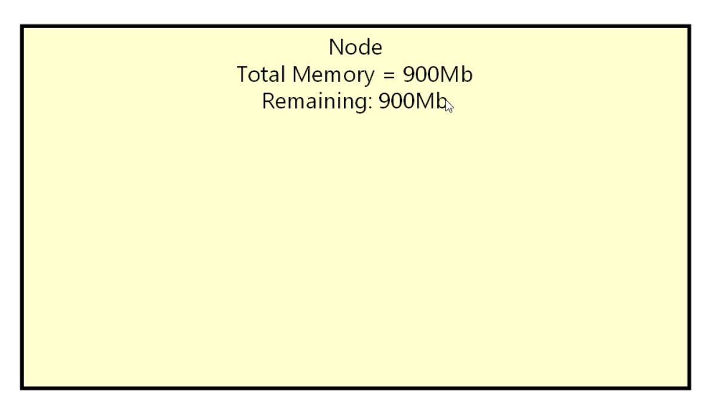
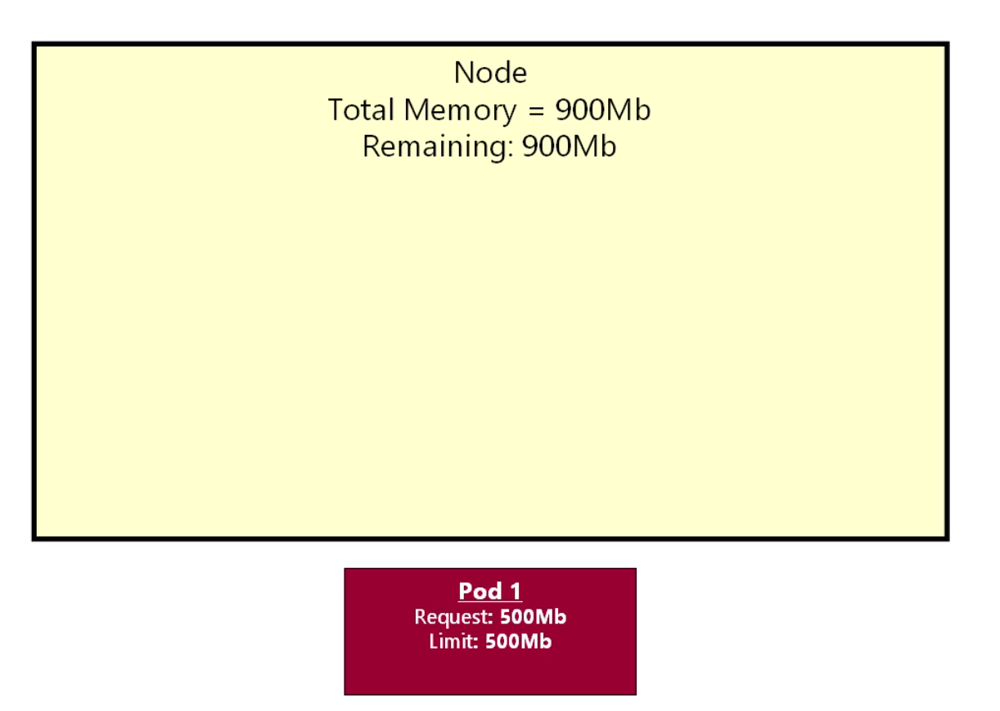
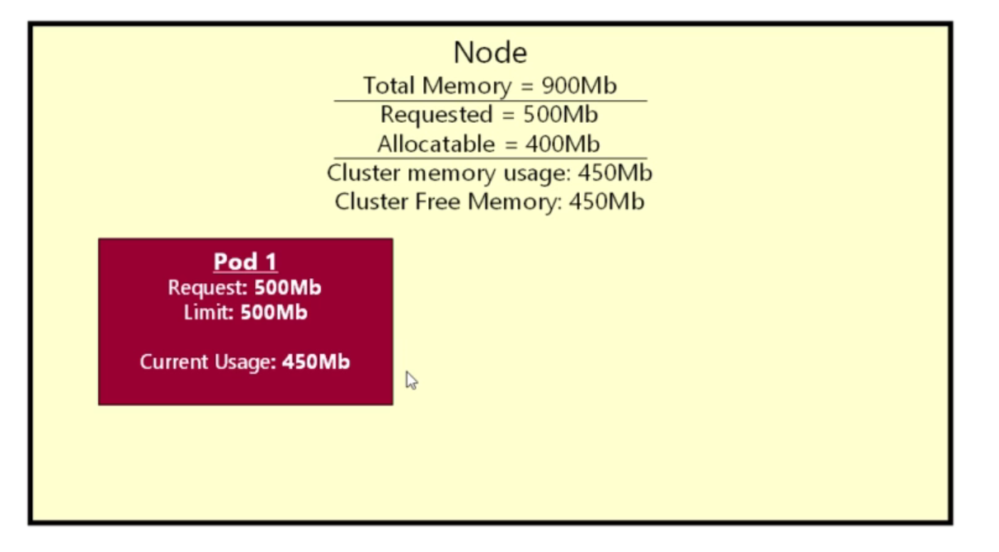
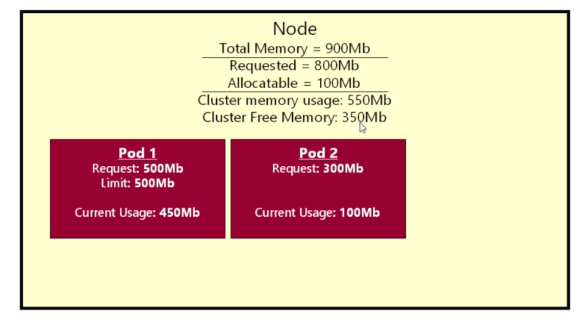
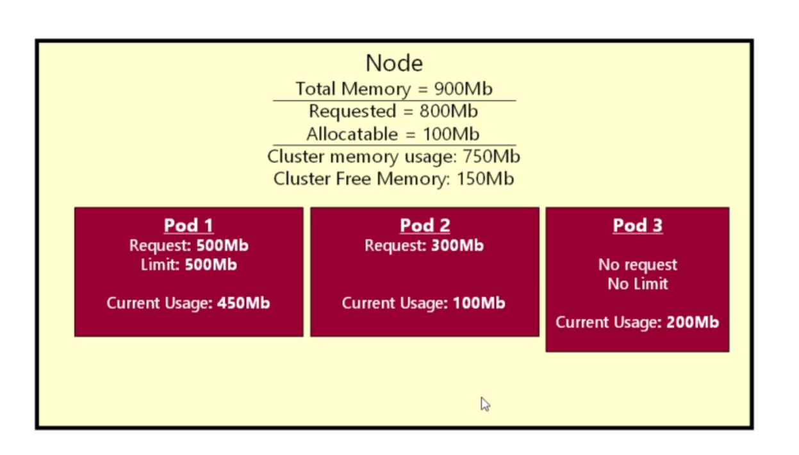

# Understanding the kubernetes scheduler

- here we will learn about the `kubernetes resource` known as the `quality of Service` or `QoS`

- we will also look into the `related topic` as `Eviction`

- in `kubernetes` we have the `kubeernetes scheduler` , the `JOb of the kubernetes scheduler` is to `decide on which kubernetes node the POD should be placed`

- when we `start` a `kubernete POD` then `kubernetes scheduler` will decide `on which Node that kubernetes POD will be placed and run`

- the `kubernetes scheduler` is a `critical component` of the `kubernetes`

- the `main job of the kuibernetes Scheduler` is `to make sure` that `any Kubernetes Node` `not to be` `overloaded`

- here we will be looking at `unfortunately sometime the kubernetes scheduler` has to `evict a kubernetes POD from the kubernetes Node`

- we will loook into `why it happens`  ? 

- and we will also look into the `impact of the eviction of the POD container` ?

- Lets imagine that `we have a kubernetes Node` inside the `kubernetes Cluster` , there might be `some other kubernetes Node` along with this `kubernetes Node` , but here we will be `focusing only one kubernetes Node` 

- we can assume that `total RAM Memory avialable` in that `kubernetes Node` being as `900Mb`

- 

- here currently `No POD been running` so we will assume that `remaining RAM Memory i.e RAM Memory available on the kubernetes Node is 900Mb`

- we will do a `kubectl apply` and create a `POD` inside the Node onto the `kubernetes cluster` as below 

- 

- here the `Developer or Deployer` of the `POD` decioded that `kubernetes POD` will consume `resources requests` with `500Mb` and `resources Limits` with `500Mb`

- the `main purpose of setting the kubernetes resource requests and kubernetes resource limits` to help the `kubernetes scheduler`

- here the `kubernetes scheduler` will perform the `reasoning` as the `POD` will take `only requests for 500Mb in order to run` and `will not certainly goes beyond 500Mb` , looking at the `kubernetes Node` , well there is `plenty of room for running the POD quite comfortably` hence the `kubernetes scheduler` will `put` the `POD inside the kubernetes Node`

- below is the running total of the `RAM Memory` utilization for the `kubernetes Node` after the `kubernetes POD` being deployed

- here the `total available RAM Memory` as `900Mb` and `POD` now requested for `RAM Memory of 500Mb`

- with the `Kubernetes Request Set` the `kubernetes scheduler know that kubernetes POD will need 500Mb in order to run comfortably`

- hence `kubernetes scheduler` will `Allopcatable Memory` is now `900Mb-500Mb=400Mb` for the `future requests for future PODs`

- when we set the `kubernetes requests or kubernetes limits` it actually `does not say How much RAM memory POD will be using physically` , once and only if the `POD` is `running` the `memory usage cloud be anything` and `will going to consume` some `RAM Memory`

- here lets suppose the `kubernetes POD is a Java application which is Resource hungry` hence tends to `consume` `450Mb RAM Memory upon the POD been running physically` which is below the `kubernetes requests and kubernetes limits` 

- here we can update the `Actual Cluster RAM Memory usage upon the POD been running as 450Mb` and the `Actual Cluster Free Memory as 450Mb`

- At this stage `everything running fine inside the kubernetes cluster`

- 

- A `little while later` then we deployed another `Kubernetes POD` into the `kubernetes cluster` and want to start up the `Kubernetes POD`

- but here in this `Kubernetes POD` we have `Set the kubernetes resources requests for RAM Memory` as `300Mb`

- the `POD` does not get the `kubernetes resources limits` set for this  

- hence the `kubernetes scheduler` need the `kubernetes Node to place the kubernetes PODs`

- here as we are assuming that `kubernetes cluster` have `only one kubernetes Node` then `scheduler` will going to decide that `well yeah the Allocateable Memory as 300Mb` hence can run the `POD on the Node`

- here we are specifying the `kubernetes resources requests` which is only `hint the kubernetes scheduler` that `it need 300Mb to run the kubernetes POD comfortably` as the `kubernetes Node` have `enough RAM Memory even after placing the first POD` hence will going to `deploy the 2nd POD onto the kubernetes Node`

- here as the `2nd kubernetes POD` requested for the `300Mb` hence the `requested Memory` will be as `300Mb(2nd POD)+500Mb(for the 1st POD)=800Mb(Total)`

- hence the `Allocabale Memory` will become Now as `900Mb-800Mb(Requested Memory)=100Mb` which will be used for the `future request for future PODs`

- after the `2nd POD` been running then the `actual physical RAM Memory Usage` as `100Mb` lets suppose

- hence the `Actual Cluster RAM Memory usage upon the POD been running as 450Mb(1st POD)+100Mb(2nd POD)=550Mb` and the `Actual Cluster Free Memory as 900Mb-550Mb(Actual CPU Memory usge)` which will be as `350Mb`  

- 

- untill here there is `No Problem` yet with the `Scheduling of the POD onto the kubernetes Node`

- now we have `3rd Kubernetes POD` which want to be `deployed onto the kubernetes cluster`

- but here the `big difference` is `Developer or Deployer` of the `kubernetes POD` does not bother specifying the `kubernetes Requests and Limits`

- even though `not setting the kubernetes resources requests and kubernetes resources limits` is not `recomended` but `this is absolutely valid`

- setting up the `kubernetes resources requests and limits` will provide the `kubernetes scheduler` the `hint` where to `deploy the POD in the Kubernetes Node`

- as we have not set the `kubernetes resources requests and limits` , hence `POD` will not provide `any clue to the kubernetes scheduler`

- there might be chance that `when this 3rd POD ran` then it can take `600Mb of RAM Memory` which is `far too much for the kubernetes Node to handle` at this point

- hence as the `kubernetes resources requests and limits si absent in the kubernetes POD definition` hence the `kubernetes scheduler` can't make  any `intelligent decession`

- here looking at the `kubernetes Node` the `kubernetes scheduler` going to decide that `it does not know` what this `POD` need in term of `resource` but `deploy it anyway`

- hence as the `kubernetes resources requests and limit` not mentioned for the `kubernetes POD` hence we will not update the `Requested Memory` and `Allocatable Memory`

- but when the `3rd kubernetes POD` starts `it will consume the actual RAM Memory` , lets say its `200Mb`

- hence the `Actual Cluster RAM Memory usage upon the POD been running as 450Mb(1st POD)+100Mb(2nd POD)+200Mb(3rd POD)=750Mb(Total)` and `Actual Cluster Free Memory as 900Mb-750Mb(Actual CPU Memory usge)` which will be as `150Mb`

- 

- untill here there is `No Problem` yet with the `Scheduling of the POD onto the kubernetes Node`

- but the `problem` being `everything running fine uptill now` but `we don't know how thing will going to change in future`

- what happens `if the Actual RAM Memory usage of the kubernetes POD` will go `certainly up` in future

- Actually the `POD1` , we are ok `Developer of the POD specified the resource requests and resources limits` and the `POD1` will never exceed `500Mb of RAM Memory`

- if the `POD1` try to get `600Mb RAM Memory` then the `POD will be evicted or Terminated` and if the `POD` being a part of the `Deployment or replicaset` will be `restarted`

- no need to panic in an well designed system `once the POD will be evicted or Terminated` then it means that `POD will be reschedule for the restart` if the `POD` being a part of the `Deployment or replicaset`

- the `key thing about the requests and limits` that `kubernetes know where it stand with the POD container` , know that `POD will not going to be get greedy`

- but we can't say that for the `other 2 POD that we deployed to the kubernetes Node`

- for the `2nd POD` there is a `requests not limits` , which will provide the `hint to the kubernetes scheduler` , but that `does not restrict` the `POD` to `consume more resource than what it requested`

- lets suppose the `2nd POD` consume `500Mb RAM Memory` then the `limiting will not work here`

- things are even `worse for the 3rd POD` , as the `kubernetes scheduler` has no idea `what the POD3 going to consume in terms of Resource`

- there might be chance that `when this 3rd POD ran` then it can take `900Mb of RAM Memory` when the `time passes`

- these `kubernetes requests and limits whether set or not set` has big impact on the `kubernetes scheduler` works

- hence based on `what we set` as a part of `kubernetes requests and limits` , kubernetes Provide `each POD a label` based on `whether the POD has the kubernetes requests and limits`

- for the `POD1` , who so ever `developed the POD` has been very nice to the `kubernetes scheduler` as both the `kubernetes requests and limits been set for that`

- hence lets suppose the `label that has been given to the 1st POD` as `Nice POD`

- where as `POD2` made the `kubernetes requests but not the limits` , hence the `kubernetes scheduler` will going to have atleast an idea that `How Big the POD can be which might not be accurate`

- hence lets suppose the `label that has been given to the 2nd POD` as `quite Nice POD`

- where as in case of the `3rd POD` has not provided `kubernetes requests and limits` and hence the `not providing any clue to the kubernetes scheduler` which is just `crashing into the node simply` which can also `exhaust the RAM Memory on the kubernetes Node` and create the `horriable problem`

- hence lets suppose the `label that has been given to the 3rd POD` as `Rude POD`

- kubernetes `Automatically` provide the `label to the POD container` based on the `requests and limits`

- it provide the `techincal term as the labels of the kubernetes POD` based on the `requests and limits`

- if we have a `POD` where the `requests and limits` been set and the `requests and limits having the same value` then `kubernetes scheduler` will assign label for the `POD` as `Qos:Guaranteed` which is know as the `Quality of Service` which means its a `nice pod` in term of `scheduling` and `scheduler can work very well with the POD`

- its not `just the RAM Memory Resources and Limits` but the `CPU requests and limits` as well which will should be `specifiec` and the `Memory and CPU have the same usgae`

- this label will be assigned by the `kubernetes scheduler` automatically `when the POD being deployed to the cluster based on the CPU requests and Memory`

- By constrast `if a POD specified the kubernetes requests but the limit` which can be `and/or CPU or Memory request` i.e if we have `atleast one requests set for the POD` then the `kubernetes scheduler` will `allocate` the `label as Qos:Burstable`

- here the `kubernetes scheduler` has a clue but does not have all the info that it need

- the `Rude POD` which is the `3rd POD` which does not specify the `kubernetes requests or limits` will be automatically given the `Qos:BestEffort` from the `kubernetes scheduler automatically`

- even though these are `just labels assigned to the kubernetes POD based on the requests and limits` , but this label will be used by the `kubernetes scheduler` if things starts `going wrong in the kubernetes Node` 

- when the `kubernetes Node run out of Resource` then these `label set on the POD by the kubernetes scheduler will come into play`

- we will look into `what these label assigned by the kubernetes scheduler on the POD` will do ?

- we will also check these `kubernetes labels` are applied to the `kubernetes POD by the kubernetes scheduler` ? 