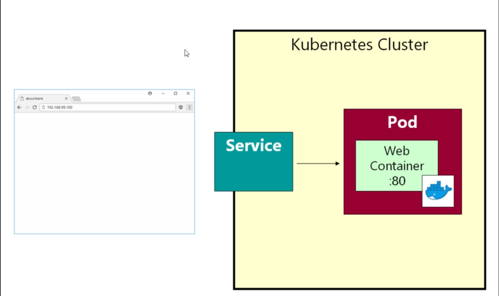
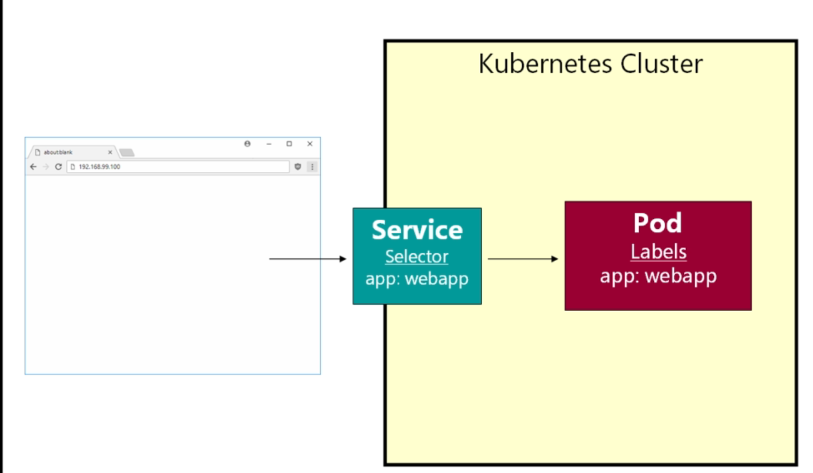

# Service in Kubernetes

- we have the `web-container POD` that `been running on port 80`

- when we try to connect the `web-container` on the `POD` which been running the web-browser on the `cluster IP` on `PORT 80` , we are unable to c9onnect to that `PORT`

- the `POD` `should not be accessed outside` the `kubernetes cluster` , as `POD` are designed to be very `throw away things`

- `PODS` have the `short live time` , `PODs` regularly die , `PODs` are regularly `recreated`

- `PODS` are treated as `cattle` rather than the `pets` , `PODs` have `ephemeral lifetime` i.e `short lived lifetime`

- because the `POD` can only be accessed inside the `minikube kubernetes cluster` 

- `kubernetes` have the `idea` of `Service` i.e `long-running object` in `kubernetes`

- `kubernetes service` have a `IP Address` and have a `stable fixed port`

- we can `attach` the `Services` to the `PODS` , we will show you `How to attach the service to the POD`

- with the `Service` we can connect to the `Kubernetes PODS` and the `Service` will find the `Suitable Port to service that request`

- 

### What is a `POD label` in Kubernetes

- we can setup the `key value pair` on the `Kubernetes POD` , we can `one` of the `key value pair` or `multiple key value pair` 

- we can provide the `POD` the label with the `key name ` as `app` and `value` as the `web-app`

- we can set the `POD label` to `any` `key name` and `value` provided , using this `POD label` we can connect the `POD` with the `Services`

- while creating the `Kubernetes Service` we need to `provide` something called as `selector`

- the `kubernetes service` we need to create the `so called selector` , which is also a `key-value pair` , on  run time `kubernetes service` Selector will look for `matching` `key-value pair` in the `POD label that we have set` , if it find the `matching key value pair` then it will connect to the `matching POD` or `Select that POD to connect to` from `selector of the Kubernetes Service`

-  

- we can build the `POD` with the `particular Label` and we will be building the `Kubernetes Service` with the `selector` so that we can connect to the `POD`

- when we use the `minikube start --driver=docker` then it will remember `the state of the POD on the last time` , it will try to `PUT that state in if we are try to achieve that ` when we `restart the minikube kubernetes cluster` and we can see the `restart` value been set to `1` as we are restarting the `minikube cluster`

- if we are using the `kubectl get all` which will provide the `status of the all object in kubernetes`

- we can use it as below 

    ```bash
        kubectl get all
        # fetching all the object of the kubernetes cluster as below 
        NAME            READY   STATUS    RESTARTS      AGE
        pod/webapp      1/1     Running   4 (25m ago)   2d7h

        NAME                     TYPE        CLUSTER-IP       EXTERNAL-IP   PORT(S)        AGE
        service/kubernetes       ClusterIP   10.96.0.1        <none>        443/TCP        2d9h
    
    ```

- if we want to see the `logs of the pod` then we can use it as below 

    
    ```bash
        kubectl describe pod webapp
        # we can see the logs of the specific pod in here 
        # we can see the logs with which PODs are getting restarted
        ame:             webapp
        Namespace:        default
        Priority:         0
        Service Account:  default
        Node:             minikube/192.168.49.2
        Start Time:       Thu, 21 Dec 2023 04:25:15 +0530
        Labels:           app=webapp
        Annotations:      <none>
        Status:           Running
        IP:               10.244.0.12
        IPs:
        IP:  10.244.0.12
        Containers:
        webapp:
            Container ID:   docker://ae5a8d47d097f901de287db522ae271f257fe0b33d08f4269ee265ea9c41a416
            Image:          richardchesterwood/k8s-fleetman-webapp-angular:release0
            Image ID:       docker-pullable://richardchesterwood/k8s-fleetman-webapp-angular@sha256:9b98fec20772bd1d7d4c9085048f28af35b31ad3a7b7d3ba395fb512c5c359e6
            Port:           <none>
            Host Port:      <none>
            State:          Running
            Started:      Sat, 23 Dec 2023 11:56:03 +0530
            Last State:     Terminated
            Reason:       Error
            Exit Code:    255
            Started:      Thu, 21 Dec 2023 11:46:46 +0530
            Finished:     Sat, 23 Dec 2023 11:55:31 +0530
            Ready:          True
            Restart Count:  4
            Environment:    <none>
            Mounts:
            /var/run/secrets/kubernetes.io/serviceaccount from kube-api-access-5cqv8 (ro)
        Conditions:
        Type              Status
        Initialized       True 
        Ready             True 
        ContainersReady   True 
        PodScheduled      True 
        Volumes:
        kube-api-access-5cqv8:
            Type:                    Projected (a volume that contains injected data from multiple sources)
            TokenExpirationSeconds:  3607
            ConfigMapName:           kube-root-ca.crt
            ConfigMapOptional:       <nil>
            DownwardAPI:             true
        QoS Class:                   BestEffort
        Node-Selectors:              <none>
        Tolerations:                 node.kubernetes.io/not-ready:NoExecute op=Exists for 300s
                                    node.kubernetes.io/unreachable:NoExecute op=Exists for 300s
        Events:
        Type    Reason          Age   From     Message
        ----    ------          ----  ----     -------
        Normal  SandboxChanged  26m   kubelet  Pod sandbox changed, it will be killed and re-created.
        Normal  Pulling         26m   kubelet  Pulling image "richardchesterwood/k8s-fleetman-webapp-angular:release0"
        Normal  Pulled          26m   kubelet  Successfully pulled image "richardchesterwood/k8s-fleetman-webapp-angular:release0" in 2.986s (2.986s including waiting)
        Normal  Created         26m   kubelet  Created container webapp
        Normal  Started         26m   kubelet  Started container webapp
    
    ```

- now we need to `create the Kubernetes Service for the pod webapp` which will provide the `Networking endpoint for the POD`

- we can fetch the `one page API reference documentation` as below in this case as [Kubernetes 1.28 API reference](https://kubernetes.io/docs/reference/generated/kubernetes-api/v1.28)

- we can see the `POD v1 core` inside the `Workloads API documentation` as below in this web page mentioned as below 

- using this `Workloads category opf APi documentation` we can fetch the `scheduled the containers the kubernetes`

- we can see the `Services` will come in the category of the `Services API` section over here , which preveiously coming under the `Discovery and Load Balancing`

- if we look into the `Example` we can see the below example here


    ```yaml
        
        service-pod.yml
        ===============
    
        kind: Service # here the type of the kubernetes object Service
        apiVersion : v1 # here the apiVersion being v1 here
        metadata:
            # unique key for the Service Instance
            name: service-example
            # here the service Instance name is absolutlely important
            # when two services taking to each other then this particular service-example will be very important
        spec:
            ports:
                # Accept the Traffic sent to particular port
                - name: http
                  port: 80
                  targetPort: 80
            
            selector: #loadbalances traffic accross the PODS matching label
                # here we can use the POD label selector
                app: nginx # here it will check for the POD with the label as app: nginx
            #with an External IP address - *Only supported
            # by some cloud providers*
            type: LoadBalancer # here the type of the service being LoadBalancer
    
        
    ```

- when we are trying to deploy the `kubernetes service` onto some `public cloud` then we need to use the `Loadbalancer` Service over here , but the `type` as the `Loadbalancer` supported by some `cloud provider` in this case

- but as we are running the `minikube local kubernetes cluster` there were no `loadbalacer available inside the local clsuter`

- for the `Local kubernetes cluster` we can use `2 approaches here`

    - we can use the `ClusterIp`as the `type`  of `kubernetes service`
      
      - if we are making the `Kubernetes Service` as the `type` as `ClusterIp` then we are telling `kubernetes` that `kubernetes service` will be accessed within the `Kubernetes cluster`
      
      - using this we are making sure that `kubernetes service` as the `internal service` such as the `micro service` then we need to use the `ClusterIp` in that case
      
      - many of the `micro-service` we are building we want to make it only accessed `within the kubernetes cluster only as internal service` then we can use the `ClusterIp`
      
      - many of the `micro-service` we are building we don't want to be `exposed outside` , we just want `other microservice inside the same kubernetes cluster` should able to communicate with the `microservice` in that case `type` of `Kubernetes Service` as `ClusterIp` make sense
       
      - we can think `ClusterIp type service` as the `private service` own terminology
      
      - it will make the `Kubernetes Service` with the `IP Address` and `stable port` as the services are `long running object in kubernetes`
      
      - `PODS` will `come and go and die as well` but `Services which is long running will act as the frontend for the POD `which has a `stable IP Address and Fixed Port`
      
      - `kubernetes service with type as ClusterIp` are being used `most of the microservice`  , b ut does not make sense for the `webapp POD` as we are exposing it outside the `cluster`

    - if we want to access the `PODs` exposed port `Outside the cluster` then we need to use the `NodePort` service in that case over here
    
      - here the `node` is the `entire kubernetes cluster` where the `PODs and Service` will reside in here
    
      - but we can have `multiple nodes inside the kubernetes cluster`
      
      - here are exposing the `Port` through the `node` which is `kubernetes cluster in that case`
      
      - the `deal` with the `NodePort Kubernetes Service type`  we can define the `port` using which we can expose the `Service` in that case
      
      - the `deal` with the `NodePort Kubernetes Service type` we can define something called as the `nodePort inside the ports section` that is as using which port of the `Node` we want to expose the `POD container exposed port`
      
      - using that `nodePort defined inside the ports kubernetes service` we can access the `PODs exposed port` outside the `kubernetes cluster`
      
      - but the catch here being `kubernetes` allow us to use the `nodePort` with value as `>30000`
      
      - we can use it as below `30080 as the nodePort inside the ports block`
      
      - we can overide that `while starting kubernetes` i.e by `starting minikube` , we can use the `wider range of port number here`
      
      - the reasoning for the `nodePort being > 30000` in order to avoid `port clashing`
      
      - if we don't specify the `nodePort` then `these number i.e nordPort port number` will be `generated by kubernetes` by its own , hence kubernetes take care `where the port being moved`
      

- if we are running inside the `public cloud` then we can replace the `NodePort Service Type` with the `Loadbalancer Service Type` 

- then we can use the `port as 80` rather than using the `30080 nodePort Service`

- if we are not publishing to the `cloud` , but want to use the `Port 80` rather than `NodePort 30080` then we can use the `ingress service`

- using the `ingress service` then we can use the `sensible port as 80 instead of 30080 nodePort`

- we can write the `webapp-service` as below 

    ```yaml
        
        webapp-service.yaml
        ====================
        apiVersion: v1
        kind: Service
        metadata:
            name: fleetman-webapp # defining the service instance name as fleetman-webapp
        spec: # defining the specificiation for port and selector in this case out in here
            Selector: #defining the selector in this case to select the particular pod label
                app: webapp # defining the Selector with key value pair here
            
            ports: # defining the ports in this case out in here
                - name: http # defining the port as http in this case 
                  port: 80 # here we are defining to which port we want to allow the trafffic
                  #here the port is equal to the tergetPort in this case 
                  nodePort: 30080 # defining the nodePort with which external User (eg browser) can access service using cluster ip
            
            type: NodePort # defining the type of Kubernetes Service as NodePort in this case 
    
    
    ```

- we can `apply` the `kubernetes Service` by using the below command here 

    
    ```bash
        kubernetes apply -f  webapp-service.yaml
        #applying the kubernetes service using the name as below
        # we can deploy the kubernetes service to the cluster using the above kubectl command describe over here
        # the output will be as below 
        service/fleetman-webapp created

        #now if we want to get all the object inside the kubernetes minikube cluster then we will get the output as below 
        kubectl get all
        #fetching all the object inside the kubernetes cluster
        AME            READY   STATUS    RESTARTS     AGE
        pod/webapp      1/1     Running   4 (8h ago)   2d16h

        NAME                      TYPE        CLUSTER-IP       EXTERNAL-IP   PORT(S)        AGE
        service/fleetman-webapp   NodePort    10.106.68.128    <none>        80:30080/TCP   81s # here we can see its been redirected from port that allow to port to which it exposed opposite  to Docker
        # here Cluster Ip is the internal Ip address of the minikube kubernetes local cluster
        # but the external IP will come only if the Type of Service is of loadbalancer which will show the external cloud IP Address but for the rest of the Service type it will be None
        # here the 80:30080/TCP means that it accept the traffic on port 80 and expose on 30080
        service/kubernetes        ClusterIP   10.96.0.1        <none>        443/TCP        2d18h
    
    
    ```

- this particular service i.e `kubernetes service` will fetch the `PODs which having the label as app: webapp` and going to `expose the Port for that servcie`

- still we can access the `expose port` on the `Web-Browser` as below

    
    ```bash
        minikube ip # this will provide the minikube kubernetes local cluster ip
        # below will be the output as 
        192.168.49.2
        # but if we want to access the web-browser then we will be getting the error as site can't be reached 
        http://192.168.49.2:30080
        # here we will be getting the error as site can't be reached 
    
    ```

- by defining the `Selector` as `app:webapp` we are telling kubernetes that the `Service` will fetch the `POD` with the `label` as `app:webapp`

- hence for that we nneed to define the `POD` with the `label` as `app: webapp` same as the selector 

- we can define the `POD label` as the `metadata section` with the `same level as name in yml file` as below 

    
    ```yaml

        pod-example.yml
        ===============
        apiVersion: v1 # defining the  apiVersion as v1 in here
        kind: Pod # defining the kind of kubernetes object as Pod
        metadata: # defining the metadata about the POD over here
            name: webapp # defining the name of the POD as webapp
            labels: # defining the label for the POD as app: webapp in here 
                app: webapp # this will be selected for the app:webapp in this case
        spec: # defining the specification in here as for the container inside it
            containers: # defining the list of container s in this case over here
                - name: webapp
                  image: richardchesterwood/k8s-fleetman-webapp-angular:release0
    
    
    ```

- here the `labels` can be off `any name that we are going to choose in this case`

- as long `labels` match with the `selector` then it will be `going to pick that PODs` to expose its `endpoint that being exposed`

- here we are chaning the YAML file hence we need to apply those changes then we can do that using the below command as 

    
    ```bash
        kubectl apply -f pod-example.yml
        #fetching the kubectl using the command as pod-example.yml
        # the below will be the output
        pod/webapp configured
        #now we check the web browser using the minikube cluster ip with the nodeport service then we can get the details as below 
        minikube ip # this will provide the minikube kubernetes local cluster ip
        # below will be the output as 
        192.168.49.2
        # but if we want to access the web-browser then we will be getting the site up and running
        http://192.168.49.2:30080
    
    ```

- lets suppose we told by the developer that `new version of the App` being avialabel in this case i.e `release0-5`

- we can do that eaily by changing the `POD definition` and changing the `image` for the `POD` service

- if we do those changes then `kubernetes PODs` need to be `stopped the existing POD` and be `start the New POD` with the ` pulled new images` we will be updating as the `PODs` are nothing but the `Wrapper around the container` that will `require some downtime`

- here we will be discussing the `Deployment with Zero Downtime` using some of the `elegant mechanism`

- but we can do a `simple deployment` using the `Zero Downtime` using the concept of `Service Selector and POD label`

- we can have `any number of POD labels and Service Selector` that we want

- we can add additional label with the `release:0` , we can add the same to the `Service selector` as `release:0`

- when we add multiple `Service Selector` then we can have the `and condition over there`

- if we have the selector with `app: webapp` and `release: 0` then service selector will look for the role `app: webapp` and `release: 0` as the `matching POD label`

- which is exactly same as the situation before where we have the `selector` will select the matched `POD label` with the `key value pair` with matching `and condition`

- we need deploy the `new version of the App` using the `second POD` in that case out in here , that `POD` will `take some time to load up` but as the `Service` is curtrently load up to the `Preveious POD label`

- once the `POD` been `up and running` then we can have the `by changing the Service selector` to the `POD label` of the `New POD` we can instruct the service to be attached to the `New POD` that been spunned on 

- now we can have the `Service Selector` been as `app: webappnew` and `release: 0` which will attached itself to the `POD label` as `app: webappnew`  and `release: 0` 

- we can switch between the `POD` by using the `Service SDelector` in that case out in here 

- we can swich between the `Prod and Dev release` inside the same `kubernetes deployment` 

- we will have the `rolling deployment` later

- we can define the `new POD` inside the same `POD` which is the standard (even though we can delcare in a separate file) , if we are using the `same yml file` then we can do that using the `document separator` as `---` in `yaml`

- we can define the `pod-example.yml` as below 

    
    ```yaml

        pod-example.yml
        ===============

        apiVersion: v1  #defining the  apiVersion as v1 in here
        kind: Pod #defining the kind of kubernetes object as Pod
        metadata: #defining the metadata about the POD over here
            name: webapp # defining the name of the POD as webapp
            labels:  #defining the label for the POD as app: webapp and release: "0" in here 
                app: webapp 
                release: "0"
        spec: # defining the specificfcation for the pods in here
            containers: # defining the container that we want to spin up in here
                - name: webapp # defining the name of the container as webapp
                  image: richardchesterwood/k8s-fleetman-webapp-angular:release0 # corresponding image for the container
        
        --- # using the document separator here to define the 2nd POD with latest version here
        apiVersion: v1 #defining the  apiVersion as v1 in here
        kind: Pod #defining the kind of kubernetes object as Pod
        metadata: #defining the metadata about the POD over here
            name: webappnew #defining the name of the POD as webappnew
            labels: # efining the label for the POD as app: webappnew and release: "0-5" in here
                app: webappnew
                release: "0-5"
        spec: # defining the specificfcation for the pods in here
            containers:  #defining the container that we want to spin up in here
                - name: webappnew # defining the name of the container as webappnew
                  image: richardchesterwood/k8s-fleetman-webapp-angular:release0-5 #corresponding image for the container


    ```

- we need to define the `Kubernetes Service` also accordingly as below

    
    ```yaml
        
        webapp-service.yaml
        ====================
        apiVersion: v1
        kind: Service
        metadata:
            name: fleetman-webapp # defining the service instance name as fleetman-webapp
        spec: # defining the specificiation for port and selector in this case out in here
            Selector: #defining the selector in this case to select the particular pod label
                app: webapp # defining the Selector with key value pair here
                release: "0" # defining the release as 0 in this case out in here to point to the existing POD in here
            ports: # defining the ports in this case out in here
                - name: http # defining the port as http in this case 
                  port: 80 # here we are defining to which port we want to allow the trafffic
                  #here the port is equal to the tergetPort in this case 
                  nodePort: 30080 # defining the nodePort with which external User (eg browser) can access service using cluster ip
            
            type: NodePort # defining the type of Kubernetes Service as NodePort in this case 
    

    ```

- we can the apply the changes to both `pod-example.yml` and `webapp-service.yml` to be sync accordingly

    
    
    ```bash
        kubectl apply -f webapp-servcie.yml
        # applying the changes to the service file in here 
        # we can get the below changes in here as well 
        service/fleetman-webapp configured
        # here it will be displayed as the Service name will be configured
        kubectl apply -f pod-example.yml
        # we can see the output as below in that case out in here 
        pod/webapp configured
        pod/webappnew created
    
    ```

- we can see the output as all the `kubernetes object inside the cluster` using the command as below 

    
    ```bash
        kubectl get all # defining all the object inside the kubernetes cluster as below 
        # the below will be the output in that case out in here as 
        NAME            READY   STATUS    RESTARTS      AGE
        pod/webapp      1/1     Running   4 (10h ago)   2d17h
        pod/webappnew   1/1     Running   4 (10h ago)   2d17h

        NAME                      TYPE        CLUSTER-IP       EXTERNAL-IP   PORT(S)        AGE
        service/fleetman-webapp   NodePort    10.106.68.128    <none>        80:30080/TCP   105m
        service/kubernetes        ClusterIP   10.96.0.1        <none>        443/TCP        2d19h
    
    ```

- now we can go to the `web browser` and access the `same minikube cluster IP with the NodePort Service Port` but if we do a `hard refresh` by clicking on `ctrl+f5` we can spot the `menu bar coming up with the map that we defined`

- we can do that as below 

    
    ```bash
        minikube ip
        # this will provide the minikube kubernetes cluster IP
        192.168.49.2
        # if we now go to the IP address with the Port that we have mentioned as nodePort then we can see the output as below 
        http://192.168.49.2:30080
        # if we do a hard refresh then we can see the Map will be loaded with the Menu option
    

    ```

- we can also `describe the service` same as `describing the POD` as below usaing the `kubectl describe service <service name> or kubectl describe svc <service name>`

    
    ```bash
        
        kubectl describe service fleetman-webapp
        #Or
        kubectl describe svc fleetman-webapp
        # fetching the kubernetes by using the service as fleetman-webapp
        # then we will be getting the below output in here
        Name:                     fleetman-webapp
        Namespace:                default
        Labels:                   <none>
        Annotations:              <none>
        Selector:                 app=webappnew,release=0-5 # here we can see the label of the Service  that we are using 
        Type:                     NodePort
        IP Family Policy:         SingleStack
        IP Families:              IPv4
        IP:                       10.106.68.128
        IPs:                      10.106.68.128
        Port:                     http  80/TCP
        TargetPort:               80/TCP
        NodePort:                 http  30080/TCP
        Endpoints:                <none>
        Session Affinity:         None
        External Traffic Policy:  Cluster
        Events:                   <none>

    
    ```

- if we want to get all the `kubernetes object inside the kubernetes cluster` then we can do that using the `kubectl get all`

- if we want to get only the `POD` details then we can do that using the command as `kubectl get pods` or `kubectl get po`

- if we want to fetch the `POD` along with `POD label` then we can fetch that using the command as `kubectl get pod --show-labels`

- if we want to `filter out or provide a selector` to a particular `POD label`  then we can use the command as `kubectl get pod --show-labels -l <label name we are searching>`

- we can see all those details as below 

    
    ```bash
        kubectl get pods / kubectl get po
        #Or fetching the PODs details only
        NAME        READY   STATUS    RESTARTS      AGE
        webapp      1/1     Running   5 (10m ago)   3d5h
        webappnew   1/1     Running   5 (10m ago)   3d4h

        # fetching the POD details along with the POD label then we can use the command as below 
        kubectl get pods --show-labels
        # below will be output in this case 
        NAME        READY   STATUS    RESTARTS      AGE    LABELS
        webapp      1/1     Running   5 (13m ago)   3d5h   app=webapp,release=0
        webappnew   1/1     Running   5 (13m ago)   3d4h   app=webappnew,release=0-5
        
        # we can filter/provide a selector the POD label then we can use the command as below 
        kubectl get pods --show-labels -l release=0
        # the output as below
        NAME     READY   STATUS    RESTARTS      AGE    LABELS
        webapp   1/1     Running   5 (15m ago)   3d5h   app=webapp,release=0

        # if we are providing the invalid info then we will be getting the error as No resource found
        kubectl get pods --show-labels -l release=1
        #output will be as
        No resources found in default namespace.
    
    
    ```

